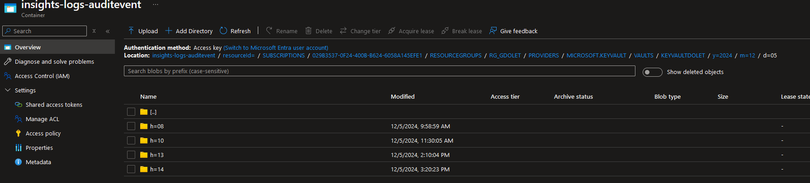

# BIENVENUE, VISITEUR:
Ma logique de travail a été d'avancer le plus rapidement possible dans le brief, sans faire les bonus et en restant sur les niveaux faciles.

Je voulais parcourir toutes les grandes étapes du brief, et ensuite, si il me reste du temps revenir en arrière pour y ajouter les bonus, ou niveau plus élevé. 

Etat du répo actuelle :
  - Script python pour charger un fichier csv et parquet locale, vers un datalake, en passant toutes les sécurités. **niveau 1**
  - Journalisation des connexions à KeyVault, stocké dans ce même datalake, en mode archive. 
  
  - Le notebook de databricks. 

# DataLake semaine 2
Deuxième semaine sur la notion de data lake (AZURE)

## Notions : 
- C’est quoi **Storage Access Keys** (clés de compte de stockage): 
	C’est comme un mot de passe généré automatiquement qui protège l’accès au compte de stockage.
- C’est quoi **Azure Key Vault** :
	système de gestion et de protection des clés (mot de passe). Point fort, on peut permuter et régénérer régulièrement les clés.
- C’est quoi un **SAS**: 
	mécanisme d’autorisation basé sur des jetons. L’intérêt est de fournir l’accès à des ressources spécifiques, sans donner l’accès global à tout le compte de stockage 
    SAP : Signature d'Accès Partagé = SAS : Shared Access Signature (delegation key)
- C'est quoi **Microsoft Endtra ID**:
     c’est un outil qui permet de gérer qui peut accéder à quoi, où service de gestion des identités et des accès.
     Il vérifie l’identité des personnes ou des applications qui essaient de se connecter à des ressources.
     Single Signe On : SSO
- C'est quoi **IAM (Identity and Access Management) et Role-Based Access Control (RBAC)**:
    Le RBAC est une méthode du IAM. Il découpe en rôle, un ou des ensemble de permissions. Puis les attribut à des utilisateurs ou à des groupes. Microsoft Entra ID est la solution d’IAM de Microsoft, conçue pour gérer les identités et les accès dans l’écosystème Microsof

## Analogie pour mieux comprendre

### Analogie : Une boîte aux lettres sécurisée dans un immeuble

Imagine un immeuble résidentiel avec un système de double sécurité pour accéder à une boîte aux lettres partagée (le Data Lake).

Il y a deux concierges (Service Principals) dans l'immeuble :
Concierge A garde une liste des noms des boîtes aux lettres et connaît leur contenu, mais il ne détient pas les clés.
Concierge B garde toutes les clés dans un coffre-fort sécurisé (Key Vault).

Lorsqu’un résident (l’application Python) veut déposer un courrier ou récupérer quelque chose, il doit :
Demander à Concierge A le nom de la boîte correspondante.
Demander à Concierge B, en utilisant le nom fourni, la clé pour ouvrir la boîte.

Une fois que le résident a obtenu la clé, il peut accéder à la boîte aux lettres sécurisée pour déposer ou récupérer le contenu.

### Traduction en contexte Azure

L'immeuble représente Azure.

La boîte aux lettres représente le Data Lake.

Concierge A (Service Principal 1) :

Définit le nom du secret qui donne accès au Data Lake.

Concierge B (Service Principal 2) :

Garde la valeur du secret dans un coffre-fort (Key Vault).

Le résident (l’application Python) :

Lit le nom du secret depuis le fichier .env local.

Fait une requête à Concierge B (Key Vault) pour obtenir la clé (la valeur du secret).

Utilise cette clé pour interagir avec le Data Lake en toute sécurité.

# DATABRICKS
### Ce que j'ai compris de la sécurité avec Databricks 

**Déroulement simplifié**
    
La création du scope dans Databricks et qui pointe vers KeyVault, permet à notre environnement de travail databricks d'accéder et lister les secrets du keyvault

Récupération du secret depuis Key Vault via le notebook de databricks avec la fonction **dbutils.secrets.get(scope="datalake_scope", key="DatabricksSPSecret")**.

On lui donne en paramètres le nom du scope et le nom du secret qui nous intéresse.

La valeur du secret (le mot de passe ou la clé d’accès) est utilisée pour authentifier l’accès au Service Principal. Cela se fait via une fonction ou une commande comme DefaultAzureCredential ou autre méthode d’authentification explicite (par exemple, via ClientSecretCredential en Python).

Service Principal authentifié :

Une fois authentifié avec succès en utilisant la valeur du secret, le Service Principal agit comme une "identité" sécurisée.
Cette identité possède les permissions attribuées (par exemple, un rôle IAM comme Storage Blob Data Contributor) qui lui permettent d’interagir avec le Data Lake.

**Accès au Data Lake** :

Grâce aux droits attachés au Service Principal, Databricks peut utiliser cette identité pour effectuer des opérations sur le Data Lake, comme écrire ou lire des fichiers.

**Résumé étape par étape**

Le secret (mot de passe) → permet de se connecter au Service Principal.

Le Service Principal → agit en tant qu'utilisateur ayant des droits IAM sur le Data Lake.

Ces droits IAM → autorisent des actions spécifiques sur le Data Lake, comme l'écriture ou la lecture.
